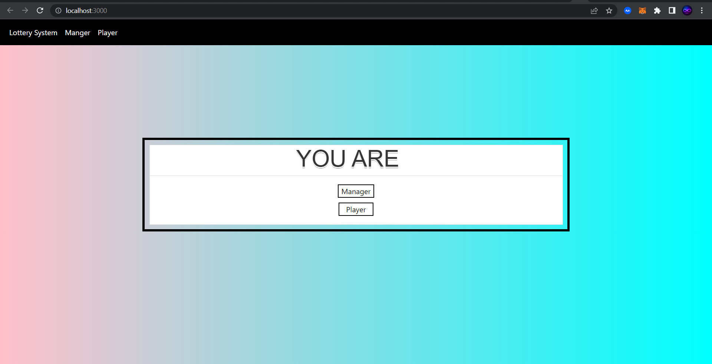
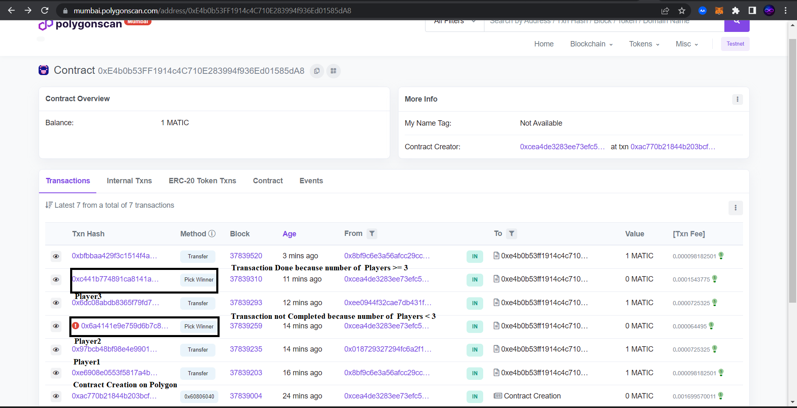

# Lottery-Dapp
- A Blockchain-based decentralized Lottery app.
[Dapp - Decentralized application]
- I have deployed the application using Mumbai Polygon Faucet [ Fake Ethers ]

## Tech-Stack
- Solidity
- Mumbai Polygon
- React Js
- Metamask

## Stakeholders
- Manager - Controls Lottery Application
- Players - Buys Lottery

## Working
- On the First Page, There are two options for a manager and a Player.
- The manager has full control over the Lottery.
- Each Player must have a Wallet and connect it to the app.
- Players must transfer one ether only to participate in the Lottery.
- As the Player will transfer ether, its address will be registered.
- A minimum of 3 Players are required for the winner to be selected.
- The manager draws the Lottery through a random Function.
- After selecting the winner, the full Balance will automatically be transferred to the Winner.
- The Contract will be reset once a round is completed.

## Layout
(Lottery Dapp Pics/Starting Page.png)

(Lottery Dapp Pics/Manager.png)

(Lottery Dapp Pics/Players.png)

## Player makes Payment 
(Lottery Dapp Pics/Contract Payment.png)

## Transaction Completed and Player Name Added
(Lottery Dapp Pics/Transaction History.png)

(Lottery Dapp Pics/Players Updated.png)

## Project Deployed on Mumbai Faucet and Full Transaction List Explained

